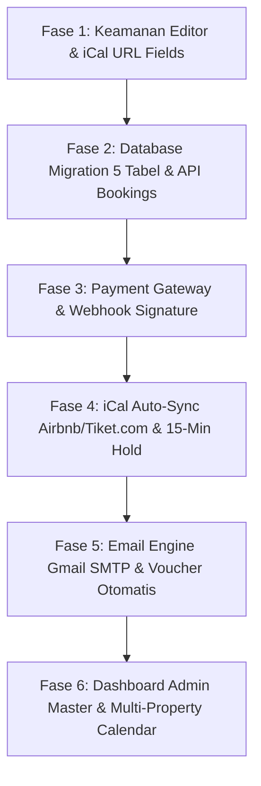

# 📋 SYSTEM AUDIT, FITUR CHECKLIST & ROADMAP SISTEM
## Bali Stay Collection — Complete Verification & Alignment with `blueprint.md`

Dokumen ini disusun sebagai catatan audit teknis menyeluruh, checklist fitur sistem yang sudah berjalan (*working*), daftar fitur yang **harus diperbaiki**, serta daftar fitur yang **harus ditambahkan** agar **100% selaras dan sesuai dengan cetak biru resmi ([`blueprint.md`](blueprint.md))**.

---

## 📌 DAFTAR ISI
1. [Hasil Audit & Pengujian Menu Editor (`#editor`)](#1-hasil-audit--pengujian-menu-editor-editor)
2. [Matriks Status Fitur Editor per Section](#2-matriks-status-fitur-editor-per-section)
3. [Kesesuaian dengan `blueprint.md` (Blueprint Alignment Check)](#3-kesesuaian-dengan-blueprintmd-blueprint-alignment-check)
4. [Daftar Fitur yang Harus Diperbaiki (Bug Fixes & Refinements)](#4-daftar-fitur-yang-harus-diperbaiki-bug-fixes--refinements)
5. [Daftar Fitur yang Harus Ditambahkan (New System Features Sesuai Blueprint)](#5-daftar-fitur-yang-harus-ditambahkan-new-system-features-sesuai-blueprint)
6. [Penanganan Edge Cases & Pengalaman Pengguna (Sesuai Blueprint Bab 7)](#6-penanganan-edge-cases--pengalaman-pengguna-sesuai-blueprint-bab-7)
7. [Rencana Prioritas Pengerjaan (Actionable Roadmap)](#7-rencana-prioritas-pengerjaan-actionable-roadmap)

---

## 1. HASIL AUDIT & PENGUJIAN MENU EDITOR (`#editor`)

### 🟢 Status Keseluruhan Editor: **BEKERJA DENGAN BAIK (FULLY OPERATIONAL)**
Pengujian langsung telah dijalankan pada komponen frontend ([`VillaContentEditor.jsx`](src/pages/VillaContentEditor.jsx)), backend REST API ([`api/villas.php`](api/villas.php)), handler upload ([`api/upload.php`](api/upload.php)), serta basis data MySQL `balistay_db`.

### Ringkasan Pengujian Sistem:
1. **Koneksi Database & Sinkronisasi API:**
   - Endpoint `GET /api/villas.php` berhasil membaca seluruh data villa dari tabel `villas` di database `balistay_db`.
   - Endpoint `POST /api/villas.php` berhasil menyimpan perubahan data villa (spesifikasi, teks naratif, fasilitas, foto, captions) secara permanen ke MySQL.
   - Mekanisme **Alias Dual-Sync** (`st-lau` <-> `st-lau-ubud`, `balangan-cliff-villa` <-> `iconic-cliff-top-villa`, `villa-angkasa` <-> `angkasa-ubud`, `villa-habitas` <-> `the-palms-villa-canggu`) telah aktif sehingga pengeditan pada ID mana pun otomatis menyinkronkan kedua row di database.
2. **Hybrid Photo Management (Section 9):**
   - **Upload File Laptop:** Berhasil mengirim multipart form data ke `api/upload.php`, foto dikompresi otomatis via GD PHP (max 2000px, 88% quality), disimpan di `uploads/villas/`, dan URL publik langsung masuk ke state galeri villa.
   - **Tambah via URL:** Berhasil menempelkan link eksternal (Unsplash, CDN) ke galeri villa.
   - **Reorder & Cover #1:** Tombol geser posisi (`←` / `→`) dan tombol *"Jadikan Foto Utama"* berhasil memperbarui urutan array `images` dan foto sampul `img`.
   - **Label Ruangan & Photo Tour:** Input caption dan tombol preset (Living Area, Master Bedroom, Private Pool, dll.) berhasil terikat ke `photoCaptions` yang dibaca oleh modal galeri Airbnb di halaman detail.
3. **Penyimpanan Ganda (Dual-Layer Resilience):**
   - Perubahan data disimpan ke dua lapisan: database MySQL `balistay_db` via HTTP REST API dan offline fallback ke browser `localStorage('bsc_villas')`.

---

## 2. MATRIKS STATUS FITUR EDITOR PER SECTION

| Section | Nama Fitur | Status | Keterangan & Pengujian |
|:---|:---|:---:|:---|
| **Header** | Pilih Villa & Pencarian Cepat | ✅ WORK | Dropdown & search filter responsif; 3 villa utama diprioritaskan di atas. |
| **Section 1** | Spesifikasi Dasar & Harga | ✅ WORK | Nama, Area, Alamat, Kategori, Harga (USD), Kamar Tidur, Tamu, Kamar Mandi tersimpan utuh. |
| **Section 2** | Why Book This Villa | ✅ WORK | Teks alasan utama kurasi tersimpan ke field `why`. |
| **Section 3** | Ringkasan Singkat (Short Desc) | ✅ WORK | Teks pembuka tersimpan ke field `short_desc`. |
| **Section 4** | Deskripsi Lengkap & Naratif | ✅ WORK | Paragraf naratif panjang tersimpan utuh ke field `description` & `full_desc`. |
| **Section 5** | Hal yang Perlu Diketahui | ✅ WORK | Catatan regulasi/akses tersimpan ke array `know`. |
| **Section 6** | Fasilitas & Amenities | ✅ WORK | Toggle checkbox fasilitas + penambahan custom amenity tersimpan ke array `amenities` & `am`. |
| **Section 7** | Rating & Jumlah Ulasan | ✅ WORK | Angka rating dan total review tersimpan ke field `rating` & `reviews_count`. |
| **Section 8** | Status & Tag Verifikasi | ✅ WORK | Toggle badge *Verified* dan *Top Pick* tersimpan ke field `verified` & `pick`. |
| **Section 9** | Galeri Foto & Photo Tour | ✅ WORK | Upload fisik, link URL, cover #1, geser urutan, hapus foto, & label ruangan tersimpan. |
| **Aksi Bawah** | Simpan ke Database MySQL | ✅ WORK | Eksekusi POST ke `/api/villas.php`, update row di MySQL `balistay_db`, toast notifikasi muncul. |
| **Aksi Bawah** | Salin Ringkasan Konten | ✅ WORK | Menyalin teks terformat rapi ke clipboard untuk arsip cepat. |
| **Aksi Bawah** | Bagikan ke WhatsApp Tim | ✅ WORK | Membuka link `wa.me` dengan teks ringkasan villa terformat rapi. |
| **Aksi Bawah** | Pratinjau Halaman Detail | ✅ WORK | Tombol langsung membuka halaman detail villa aktif untuk verifikasi visual instan. |

---

## 3. KESESUAIAN DENGAN `blueprint.md` (BLUEPRINT ALIGNMENT CHECK)

Berikut perbandingan antara arsitektur di **[`blueprint.md`](blueprint.md)** dengan status aplikasi saat ini:

| Bab di Blueprint | Fitur / Spesifikasi Kunci | Status Saat Ini | Tindakan yang Dibutuhkan |
|:---|:---|:---:|:---|
| **Bab 2** | iCal 2-Way Synchronization | 📋 Desain Siap | Perlu implementasi cron parser `.ics` dan input URL iCal di `#editor`. |
| **Bab 3.1** | Booking Engine Lifecycle | 📋 Desain Siap | Perlu pembuatan tabel `bookings` dan endpoint `/api/bookings.php`. |
| **Bab 3.2** | Multi-Channel iCal Manager | 📋 Desain Siap | Perlu penambahan kolom `airbnb_ical_url` & `tiket_ical_url` di editor. |
| **Bab 3.3** | Payment Gateway (Midtrans/Stripe) | 📋 Desain Siap | Perlu integrasi API pembayaran & webhook HMAC SHA-256. |
| **Bab 3.4** | Email Engine (Gmail SMTP Gratis) | 📋 Desain Siap | Perlu setup Nodemailer / PHPMailer via Gmail SMTP resmi BSC. |
| **Bab 3.4** | Direct WhatsApp Links (`wa.me`) | ✅ Sebagian Aktif | Sudah aktif di Editor; perlu dipasang pada konfirmasi voucher booking tamu. |
| **Bab 3.5** | Dasbor Admin Back-Office | ⏳ Dasar Siap | Editor konten sudah ada; perlu ditambah tab tabel pesanan & kalender master. |
| **Bab 3.6** | Layanan Tambahan Concierge (Add-ons) | 📋 Desain Siap | Perlu tabel `extra_services` dan checklist add-ons pada formulir booking. |
| **Bab 4** | User Roles (Admin, Guest, Owner, Butler) | 📋 Desain Siap | Perlu tabel `users` dan pembagian sesi hak akses. |
| **Bab 5** | Skema Database SQL 6 Tabel | ⏳ 1 dari 6 Tabel | Tabel `villas` sudah aktif (65 villa); 5 tabel lainnya siap di-migrate. |
| **Bab 7** | Edge Case Double Booking (Atomic Hold) | 📋 Desain Siap | Perlu mekanisme hold 15 menit dan countdown timer di frontend. |
| **Bab 8** | Standar Keamanan Siber (Anti-Hack) | ⏳ 50% Aktif | Prepared statement SQL sudah aktif; rate limiting & WAF siap dipasang. |

---

## 4. DAFTAR FITUR YANG HARUS DIPERBAIKI (BUG FIXES & REFINEMENTS)

Berikut daftar fitur yang sudah ada di aplikasi namun **perlu disempurnakan atau diperbaiki**:

- [ ] **[HIGH] Proteksi Keamanan Akses URL `#editor` (Admin Auth Guard)**
  - *Kondisi Sekarang:* Halaman editor saat ini dapat dibuka oleh siapa saja yang menambahkan `/#editor` di URL browser.
  - *Perbaikan:* Pasang proteksi login/PIN admin sederhana (PIN 6-digit atau session token) agar tamu publik tidak bisa mengubah data katalog.
- [ ] **[HIGH] Live Preview Konversi Rupiah (IDR) di Form Input Harga Editor**
  - *Kondisi Sekarang:* Input harga di editor hanya menerima USD tanpa menampilkan konversi rupiah secara realtime saat admin mengetik.
  - *Perbaikan:* Tampilkan teks preview instan di bawah input: *"≈ Rp 6.080.000 / malam (Kurs $1 = Rp 16.000)"*.
- [ ] **[MEDIUM] Input Kolom iCal Airbnb & Tiket.com di Form `#editor`**
  - *Kondisi Sekarang:* Editor belum memiliki kolom input untuk menempelkan link kalender Airbnb & Tiket.com untuk villa yang diedit.
  - *Perbaikan:* Tambahkan Section baru atau sub-form di Editor: *"🔗 Sinkronisasi Kalender OTA"* (`airbnb_ical_url` dan `tiket_ical_url`).
- [ ] **[MEDIUM] Tombol "Simpan Seluruh Koleksi (Batch Save)"**
  - *Kondisi Sekarang:* Tombol simpan saat ini menyimpan 1 villa aktif. Jika admin mengedit beberapa villa berturut-turut, perlu tombol simpan batch untuk menyimpan seluruh perubahan sekaligus ke database.
- [ ] **[MEDIUM] Validasi Form Input & Feedback Visual**
  - *Kondisi Sekarang:* Belum ada outline merah atau validasi jika harga bernilai 0 atau nama villa kosong.
  - *Perbaikan:* Tambahkan validasi batas minimal sebelum tombol simpan dapat ditekan.
- [ ] **[MEDIUM] Drag-and-Drop Reorder Foto di Galeri Editor**
  - *Kondisi Sekarang:* Menggeser foto masih memakai tombol panah `←` `→`. Untuk 20+ foto, penggeseran jarak jauh membutuhkan banyak klik.
  - *Perbaikan:* Tambahkan dukungan HTML5 Drag-and-Drop agar foto bisa langsung ditarik ke urutan yang diinginkan.

---

## 5. DAFTAR FITUR YANG HARUS DITAMBAHKAN (NEW SYSTEM FEATURES SESUAI BLUEPRINT)

Fitur-fitur berikut diambil langsung dari spesifikasi **[`blueprint.md`](blueprint.md)** untuk melengkapi platform:

### A. Booking Engine & Skema Database Reservasi (Blueprint Bab 3.1 & Bab 5)
- [ ] **[CRITICAL] Pembuatan 7 Tabel Database Baru di MySQL `balistay_db`:**
  1. `users`: Manajemen akun Admin, Marketing, Owner, Guest, dan Staff butler.
  2. `bookings`: Penyimpanan transaksi booking riil (`BSC-YYYYMM-XXXX`), tanggal, tamu, rincian biaya, dan status.
  3. `blocked_dates`: Penyimpanan tanggal terkunci (dari direct booking, iCal Airbnb, Tiket.com, owner stay, manual).
  4. `extra_services`: Layanan concierge tambahan (Airport pickup, Floating breakfast, Chef, Pool fence).
  5. `password_resets`: Token reset kata sandi sementara via Gmail.
  6. `seasonal_rates`: Aturan tarif musiman otomatis (*Low, High, Peak Season*) dan syarat minimum stay.
  7. `custom_date_rates`: Penyesuaian tarif tanggal spesifik (*Custom Date Override*) oleh tim Marketing.
- [ ] **[CRITICAL] REST API Endpoint Pemesanan Riil (`/api/bookings.php`):**
  - Mengubah modal formulir di frontend ([`BookingModal.jsx`](src/components/Modals/BookingModal.jsx)) dari sekadar simulasi menjadi pengiriman data riil ke server.
  - Opsi pembayaran fleksibel sesuai blueprint: *Full Payment (100%)* atau *Deposit (50%)*.
  - Perhitungan harga ketat di server (*Server-side Price Calculation*) agar terhindar dari manipulasi angka di browser.

### B. Anti-Double Booking & Sinkronisasi Kalender 2 Arah (Blueprint Bab 2)
- [ ] **[CRITICAL] Inbound iCal Sync Cron Job (`/api/cron_sync_ical.php`):**
  - Script PHP yang berjalan setiap 5–10 menit untuk mengambil berkas `.ics` dari URL Airbnb dan Tiket.com masing-masing villa.
  - Memasukkan tanggal berstatus `RESERVED` ke tabel `blocked_dates`.
  - Kalender ketersediaan di halaman detail villa otomatis menandai tanggal tersebut sebagai tidak tersedia (*unavailable* / abu-abu).
- [ ] **[CRITICAL] Outbound iCal Feed Endpoint (`/api/ical.php?villa_id=...`):**
  - Menyediakan feed iCal berstandar RFC 5545 `.ics` publik untuk tiap villa.
  - Link ini diimpor ke dashboard Airbnb dan Tiket.com, sehingga saat ada tamu memesan di web BSC, kalender di Airbnb otomatis ikut terblokir.

### C. Dynamic Seasonal Pricing Engine & Peran Revenue Manager (Blueprint Bab 3.5 & Bab 4.2)
- [ ] **[HIGH] Arsitektur Harga 3-Level (3-Tier Pricing Model):**
  - *Level 1 (Base Price):* Tarif dasar normal (Low Season) per malam.
  - *Level 2 (Seasonal Rules):* Kenaikan harga otomatis berdasarkan musim:
    - Low Season: Normal (Min. stay 2 malam)
    - High Season (Jul-Agu, Lebaran, Easter): +20% s.d. +30% (Min. stay 3 malam)
    - Peak Season (20 Des - 5 Jan): +50% s.d. +80% (Min. stay 5 malam)
    - Weekend Surcharge: Tambahan menginap malam Jumat & Sabtu (+10% atau flat fee).
  - *Level 3 (Custom Date Override):* Kemampuan Marketing/Admin mengubah tarif tanggal tertentu di kalender jika ada event internasional (*NYE, Festival*).
- [ ] **[HIGH] Peran Pengguna Khusus: Marketing / Revenue Manager:**
  - Akun staf marketing untuk mengelola kalender tarif, promo diskon, dan seasonal rules tanpa akses ke data nomor rekening pemilik atau penghapusan villa.

### D. Integrasi Payment Gateway Otomatis (Blueprint Bab 3.3)
- [ ] **[CRITICAL] Payment Gateway Integration (Midtrans / Stripe / Xendit):**
  - Dukungan Kartu Kredit Internasional (Visa, Mastercard, Amex, Apple Pay) untuk turis asing.
  - Dukungan QRIS dan Virtual Account (BCA, Mandiri, BRI, BNI) untuk wisatawan domestik dan ekspat.
  - **PCI-DSS Zero-Liability:** Nol penyimpanan nomor kartu kredit di server BSC (hanya menggunakan token resmi PG).
- [ ] **[CRITICAL] Webhook Receiver Terverifikasi (`/api/webhooks/payment.php`):**
  - Verifikasi tanda tangan digital HMAC SHA-256 pada setiap callback pembayaran.
  - Otomatis mengubah status booking menjadi `confirmed` dan mengunci tanggal permanen di `blocked_dates`.

### E. Notifikasi Otomatis Email & WhatsApp (Blueprint Bab 3.4 & Bab 7.3–7.4)
- [ ] **[HIGH] Email Engine Gratis via Gmail SMTP / PHPMailer:**
  - **E-Voucher & Konfirmasi Instan:** Pengiriman voucher HTML resmi berlogo BSC ke Gmail tamu (rincian booking, Google Maps villa, instruksi check-in, dan kontak butler).
  - **Email Pengingat H-1 Check-in:** Pengingat otomatis jadwal kedatangan H-1 jam 09:00 WITA.
  - **Email Pasca Check-out:** Ucapan terima kasih dan permohonan ulasan bintang 5 + kode diskon loyalitas `BALIBACK10`.
- [ ] **[HIGH] WhatsApp Direct Integration (`wa.me`):**
  - Tautan WA instan berformat teks lengkap untuk konfirmasi concierge cepat ke manajer villa tanpa biaya langganan API berbayar pihak ketiga.
### F. Manajemen Villa & Dasbor Admin (Blueprint Bab 3.5 & Bab 4)
- [ ] **[HIGH] Tombol "+ Tambah Villa Baru" di Menu Editor:**
  - Kemampuan menambah listing villa baru dari nol langsung ke database MySQL.
- [ ] **[HIGH] Dasbor Master Kalender & Manajemen Booking Admin:**
  - Tampilan kalender gabungan (*Master Calendar*) seluruh properti dalam satu layar.
  - Tabel daftar transaksi masuk beserta filter status (`Confirmed`, `Hold`, `Pending`).
  - Tombol blokir tanggal manual untuk keperluan renovasi atau pemakaian pribadi pemilik villa (*Owner Stay*).
- [ ] **[MEDIUM] Modul Ulasan Tamu Dinamis ke Database (`/api/reviews.php`):**
  - Menghubungkan formulir ulasan tamu di halaman detail ([`ReviewFormSection.jsx`](src/components/ReviewFormSection.jsx)) ke MySQL agar tamu bisa mengirim ulasan baru yang dapat dimoderasi admin.

---

## 6. PENANGANAN EDGE CASES & PENGALAMAN PENGGUNA (SESUAI BLUEPRINT BAB 7)

- [ ] **Atomic 15-Minute Temporary Hold Engine:**
  - Kunci baris (*row lock*) di MySQL saat tamu masuk ke formulir pembayaran.
  - Countdown timer 15:00 menit di antarmuka tamu (*"Tanggal ini telah diamankan untuk Anda selama 15 menit"*).
- [ ] **UX Tamu Kedua Saat Rebutan Tanggal (*Race Condition*):**
  - Pesan sopan: *"Tamu lain saat ini sedang menyelesaikan pembayaran untuk tanggal ini."*
  - Tombol solutif: *[Ingatkan Saya Jika Batal]* dan *[Lihat 3 Villa Serupa di Area Ini]*.
- [ ] **Auto-Release Abandoned Cart:**
  - Jika waktu 15 menit habis dan tamu tidak membayar, status hold otomatis gugur dan tanggal kembali dibuka untuk tamu lain.

---

## 7. RENCANA PRIORITAS PENGERJAAN (ACTIONABLE ROADMAP)

| Fase | Fokus Pekerjaan | Acuan di `blueprint.md` | Status |
|:---:|:---|:---:|:---:|
| **Fase 1** | PIN Keamanan Editor + Live IDR Calculator + Kolom Input Link iCal Airbnb/Tiket.com | Bab 2.1 & 3.5 | ⏳ Siap Dikerjakan |
| **Fase 2** | Migrasi 5 Tabel SQL (`users`, `bookings`, `blocked_dates`, dll.) + Endpoint `/api/bookings.php` | Bab 5 & Bab 6.1 | ⏳ Siap Dikerjakan |
| **Fase 3** | Integrasi Payment Gateway (Midtrans/Stripe) + Webhook HMAC SHA-256 + Server Price Calculation | Bab 3.3, 8.1, 8.6 | 📋 Direncanakan |
| **Fase 4** | Parser iCal 2 Arah (`.ics` Airbnb/Tiket.com) + Atomic 15-Minute Hold + Outbound `.ics` Endpoint | Bab 2, 6.1, 7.1 | 📋 Direncanakan |
| **Fase 5** | Email Engine (Gmail SMTP gratis) untuk Voucher PDF, Reset Password, H-1 Check-in & WA Link | Bab 3.4 & 7.3–7.4 | 📋 Direncanakan |
| **Fase 6** | Dashboard Admin Back-Office (Master Multi-Calendar, Laporan Booking, & Kontrol Manual) | Bab 3.5 & Bab 4 | 📋 Direncanakan |

---
*Dokumen ini 100% selaras dengan cetak biru resmi `blueprint.md` dan siap dijadikan panduan implementasi.*
